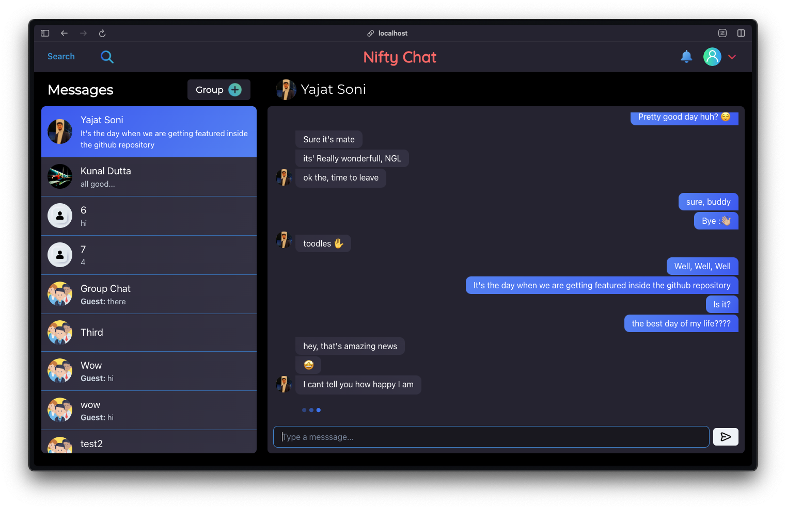

# [Nifty-Chat](chat.kunaldutta.com)
- This is a chat app made using MERN Stack and Socket.io for realtime conversations.
- A chatting app with One-to-One Chat and Group Chat functionality.
- Authentication and data encryption using Bcrypt and JWT
- Real time notifications in-app for any new messages
- Typing indicators to know when your friend is typing something...
- Global Search to find your friends on this platform
- Fully Responsive design for Mobile and Desktop
- Upload your images to let your friends know at a glance it's you

### Authentication Page

### Messaging Page

## License
**Nifty Chat** is licensed under a custom license. By using, copying, modifying, or distributing this software, you agree to the following terms:

1. You are permitted to use, copy, modify, and distribute this software for personal and educational purposes only.

2. Commercial use of this software is strictly prohibited without explicit written permission from the author.

3. If you use this software in your own projects or research, you must provide proper attribution to the original author.

4. Any distribution of this software or derivative works must include this license and copyright notice.

5. To request permission for commercial use or for any questions regarding licensing, please contact:
   kunalduttaedu@gmail.com

Copyright © Kunal Dutta 2024 • Nifty Chat

**Nifty Chat** is licensed under the Creative Commons Non-Commercial (CC BY-NC) license. This means you are free to:

- **Clone and use** the project for personal and educational purposes only.
- **Give appropriate credit** to the original author.

For any other use, including commercialization, you must first obtain permission by contacting mailto:kunalduttaedu@gmail.com.

**Copyright © Kunal Dutta 2024 • Nifty Chat**